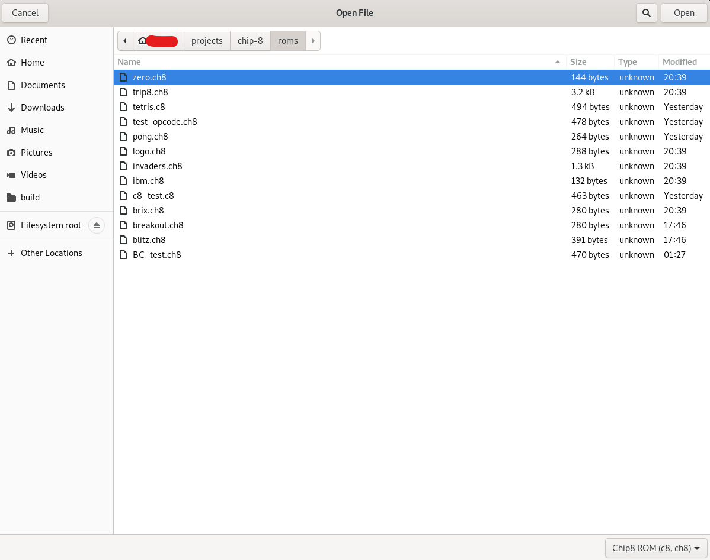
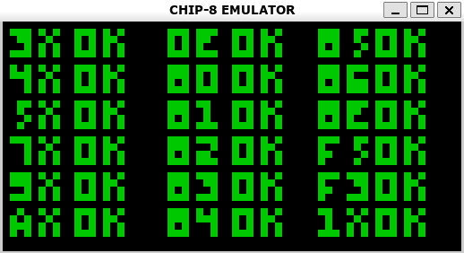
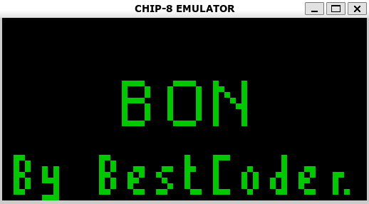
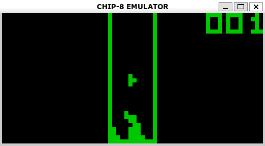
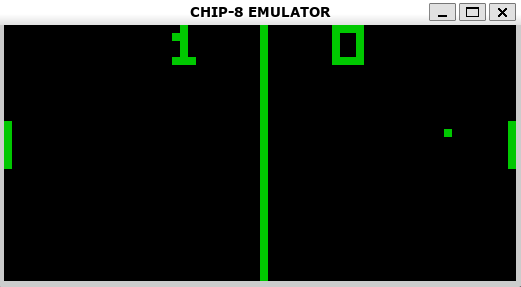

# CHIP-8 Emulator/Interpreter

This a CHIP-8 emulator/interpreter I programmed in the C Programming Language , mainly for practicing C programming, learnng about computer architecture concepts, reading assembly code etc. CHIP-8 is an interpreted programming language. More info on CHIP-* can be found in the [Wikipedia Page](https://en.wikipedia.org/wiki/CHIP-8).

# Screenshots

Below are some screenshots to show the project. 
<div align="center">
File Dialog           |
:-------------------------:|
    |
</div>

Opcode Test Rom             |  BC Test Rom
:-------------------------:|:-------------------------:
  |  

Tetris             |  Pong
:-------------------------:|:-------------------------:
  |  

# Build Instructions

## Linux

Firs, CMAKE and SDL2 installed:

```bash
sudo apt-get install cmake libsdl2-dev
sudo apt install cmake
```
To build the project:

```bash
mkdir build
cd build
cmake ..
make
```
To run from the build directory:

```bash
./chip8
```

## Windows

GCC is required. I used these [Instructions](https://code.visualstudio.com/docs/cpp/config-mingw).

For make, I reccommend using [GnuWin32](http://gnuwin32.sourceforge.net/packages/make.htm), and add the bin folder in its installation folder to Windows PATH.

SDL2.0 can be found here: [SDL2](https://www.libsdl.org/download-2.0.php), but edit the `CMakeLists.txt` with the the correct SDL2 directory, it may be different.

To build (using Powershell):
```bash
mkdir build
cd build
cmake .. -G "Unix Makefiles"
make
```
To run from the build directory:
```bash
.\chip8
```

# Key Mappings

<div align="center">
<table>
<tr><th> <center> CHIP-8 </th><th> <center>Keyboard</th></tr>
<tr><td>

| `1` | `2` | `3` | `C` |
|:-:|:-:|:-:|:-:|
| `4` | `5` | `6` | `D` |
| `7` | `8` | `9` | `E` |
| `A` | `0` | `B` | `F` |

</td><td>

| `1` | `2` | `3` | `4` |
|:-:|:-:|:-:|:-:|
| `Q` | `W` | `E` | `R` |
| `A` | `S` | `D` | `F` |
| `Z` | `X` | `C` | `V` |

</td></tr> </table>

</div>

# Special Thanks To

This project wouldn't have been possible without these valuable resouces

- https://en.wikipedia.org/wiki/CHIP-8
- https://github.com/btzy/nativefiledialog-extended
- https://austinmorlan.com/posts/chip8_emulator/#how-does-a-cpu-work
- https://github.com/JadedTuna/chip8
- https://stackoverflow.com/questions/10110905/simple-sound-wave-generator-with-sdl-in-c/45002609#45002609
- http://devernay.free.fr/hacks/chip8/C8TECH10.HTM